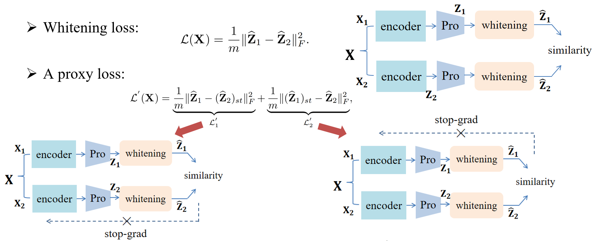
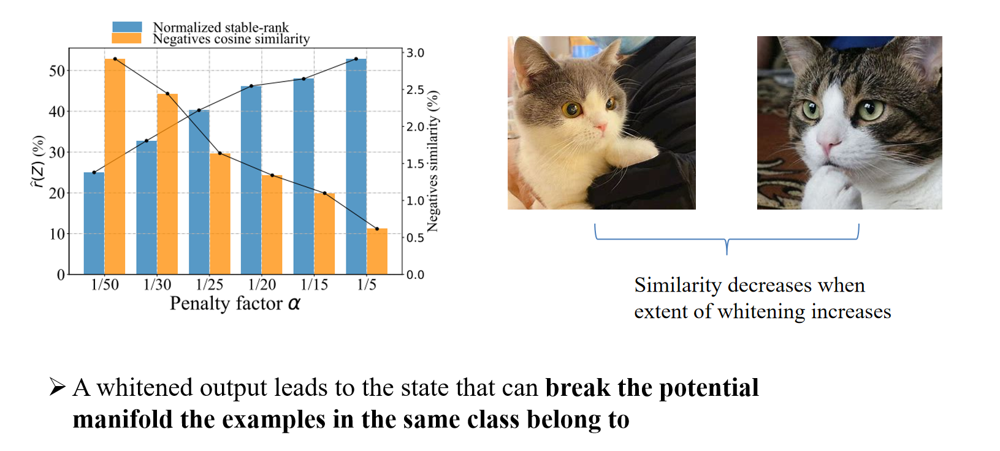

# An Investigation into Whitening Loss for Self-supervised Learning

## Analysing Decomposition of Whitening Loss
<p align="center">
  
</p>

## Whitened Output is not a Good Representation
<p align="center">
  
</p>

This is an official implementation of [CW-RGP](https://arxiv.org/abs/2210.03586).

```
@inproceedings{
weng2022an,
title={An Investigation into Whitening Loss for Self-supervised Learning},
author={Xi Weng and Lei Huang and Lei Zhao and Rao Muhammad Anwer and Salman Khan and Fahad Khan},
booktitle={Advances in Neural Information Processing Systems},
editor={Alice H. Oh and Alekh Agarwal and Danielle Belgrave and Kyunghyun Cho},
year={2022},
url={https://openreview.net/forum?id=BbUxkmrstyk}
}
```

## Requirements
- Install PyTorch ([pytorch.org](http://pytorch.org))
- Install wandb for Logging ([wandb.ai](https://wandb.ai/)) 

## Experiments
The code includes experiments in section 4.1. 

### Experimental Setup for Comparison of Baselines
The datasets include CIFAR-10, CIFAR-100, STL-10 and Tiny ImageNet, 
and the setup is strictly following [W-MSE paper](https://arxiv.org/abs/2007.06346).

The unsupervised pretraining scripts for small and medium datasets are shown in `scripts/base.sh`

The results are shown in the following table:

<table><tbody>
<!-- START TABLE -->
<!-- TABLE HEADER -->
<th valign="bottom">Method</th>
<th valign="bottom">CIFAR-10</th>
<th valign="bottom">CIFAR-100</th>
<th valign="bottom">STL-10</th>
<th valign="center">Tiny-ImageNet</th>
<!-- TABLE BODY -->
<tr>
<td align="center"></td>
<td align="center"><b>top-1&nbsp;&nbsp;5-nn</b></td>
<td align="center"><b>top-1&nbsp;&nbsp;5-nn</b></td>
<td align="center"><b>top-1&nbsp;&nbsp;5-nn</b></td>
<td align="center"><b>top-1&nbsp;&nbsp;5-nn</b></td>
</tr>
<tr>
<td align="center">CW-RGP 2</td>
<td align="center">91.92&nbsp;&nbsp;89.54</td>
<td align="center">67.51&nbsp;&nbsp;57.35</td>
<td align="center">90.76&nbsp;&nbsp;87.34</td>
<td align="center">49.23&nbsp;&nbsp;34.04</td>
</tr>
<tr>
<td align="center">CW-RGP 4</td>
<td align="center">92.47&nbsp;&nbsp;90.74</td>
<td align="center">68.26&nbsp;&nbsp;58.67</td>
<td align="center">92.04&nbsp;&nbsp;88.95</td>
<td align="center">50.24&nbsp;&nbsp;35.99</td>
</tr>
</tbody></table>

### Experimental Setup for Large-Scale Classification

The unsupervised pretraining and linear classification scripts for ImageNet are shown in `scripts/ImageNet.sh`

#### Pre-trained Models
Our pretrained ResNet-50 models:
<table><tbody>
<!-- START TABLE -->
<!-- TABLE HEADER -->
<th valign="bottom">pretrain<br/>epochs</th>
<th valign="bottom">batch<br/>size</th>
<th valign="bottom">pretrain<br/>ckpt</th>
<th valign="bottom">lincls<br/>ckpt</th>
<th valign="center">top-1 acc.</th>
<!-- TABLE BODY -->
<tr>
<td align="center">100</td>
<td align="center">512</td>
<td align="center"><a href="https://drive.google.com/file/d/1p137aJGGtQIKc_UErx1F0IgUeEbhApS5/view?usp=sharing">train</a></td>
<td align="center"><a href="https://drive.google.com/file/d/1xFsZjQZQ1SUPnhZ1MaZlODNjhqdNKW5h/view?usp=sharing">lincls</a></td>
<td align="center">69.7</td>
</tr>
<tr>
<td align="center">200</td>
<td align="center">512</td>
<td align="center"><a href="https://drive.google.com/file/d/1xMWmEW-AykQ5hdlfir0Tjjn8-UOOMHyx/view?usp=sharing">train</a></td>
<td align="center"><a href="https://drive.google.com/file/d/1mqQS-YwbP7imf2LHRIp-wSmx-8AOjIAm/view?usp=sharing">lincls</a></td>
<td align="center">71.0</td>
</tr>
</tbody></table>

### Transferring to Object Detection
Same as [MoCo](https://github.com/facebookresearch/moco) for object detection transfer, please see [moco/detection](https://github.com/facebookresearch/moco/tree/master/detection).

Transfer learning results of CW-RGP (200-epochs pretrained on ImageNet):
| downstream task |$AP_{50}$| $AP$ | $AP_{75}$ |ckpt|log|
| :----:  |:------:| :--: | :--: | :--: | :--: |
| VOC 07+12 detection  | $82.2_{±0.07}$|$57.2_{±0.10}$ | $63.8_{±0.11}$| [voc_ckpt](https://drive.google.com/file/d/1yUnBCCqcjBRhFJMi8R-cvnTIgqCUh7YB/view?usp=sharing)|[voc_log](https://drive.google.com/file/d/1tKUmBHUQiNZauiZ3Oe4-6YMsRG9iqILp/view?usp=sharing)|
| COCO detection| $60.5_{±0.28}$|$40.7_{±0.14}$ | $44.1_{±0.14}$|[coco_ckpt](https://drive.google.com/file/d/1_QGsK9Uvk60yeAgpMYChUB7QKc9kahTJ/view?usp=sharing) |[coco_log](https://drive.google.com/file/d/1ywNNEHGdX-ecztQV9nDFWN91Mu5cP1h6/view?usp=sharing)|
| COCO instance seg.| $57.3_{±0.16}$|$35.5_{±0.12}$ | $37.9_{±0.14}$|[coco_ckpt](https://drive.google.com/file/d/1_QGsK9Uvk60yeAgpMYChUB7QKc9kahTJ/view?usp=sharing) | [coco_log](https://drive.google.com/file/d/1ywNNEHGdX-ecztQV9nDFWN91Mu5cP1h6/view?usp=sharing)|

